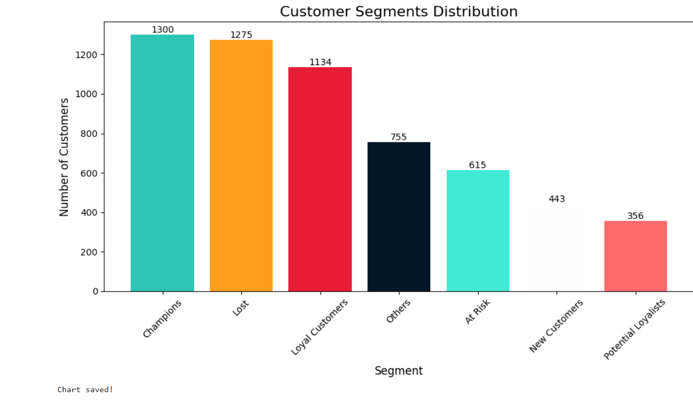
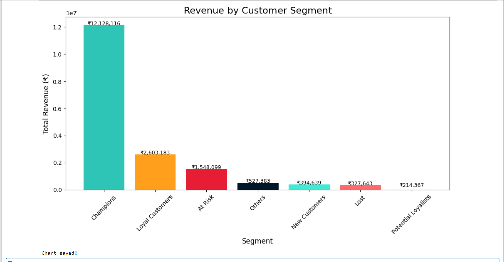
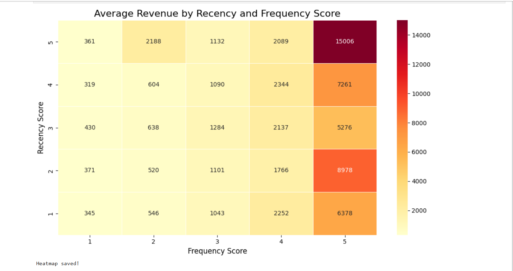

# RFM Customer Segmentation Analysis

## Problem Statement
Segment 5,878 customers of an online retail business 
into meaningful groups using RFM analysis to help the 
business target the right customers with the right strategy.

## Dataset
- Source: Online Retail II — Kaggle
- Size: 1,067,371 rows (805,549 after cleaning)
- Period: 2009 to 2011

## Tools Used
- Python (Pandas, Matplotlib, Seaborn)
- Jupyter Notebook

## Steps Followed
1. Loaded and cleaned raw retail data
2. Removed cancelled orders and missing Customer IDs
3. Calculated Recency, Frequency and Monetary values
4. Scored each customer 1-5 on each RFM dimension
5. Segmented customers into 7 groups
6. Visualized segment distribution and revenue contribution

## Customer Segments
| Segment | Customers | Revenue |
|---|---|---|
| Champions | 1,300 | ₹12,128,115 |
| Loyal Customers | 1,134 | ₹2,603,183 |
| At Risk | 615 | ₹1,548,098 |
| Lost | 1,275 | ₹327,643 |
| New Customers | 443 | ₹394,638 |
| Potential Loyalists | 356 | ₹214,366 |

## Key Insights
1. Champions (22% of customers) drive 69% of total revenue
2. At Risk segment (615 customers) contributed ₹1,548,098 
   — immediate win-back campaign recommended
3. Lost customers (1,275) generate only 2% of revenue 
   despite being 22% of all customers

## Visualizations

## Business Recommendations
1. Champions → Reward with loyalty programs and early access
2. At Risk → Send personalized win-back email campaigns
3. Lost → Low priority, minimal marketing spend
4. New Customers → Nurture with onboarding offers
